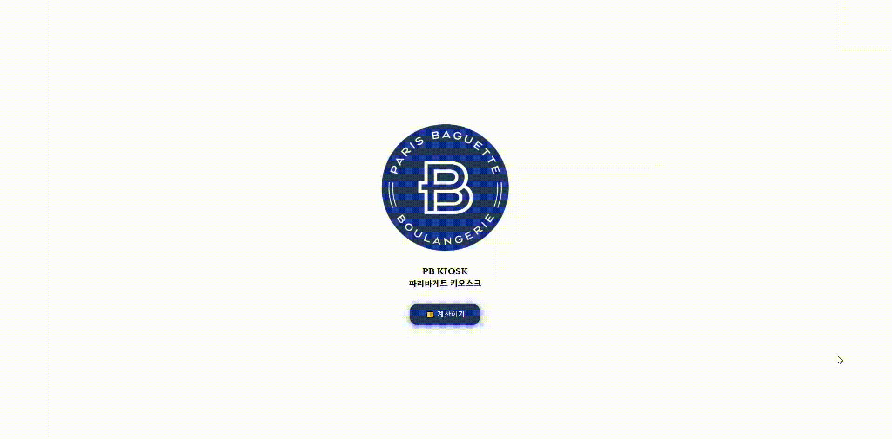

# Project-KIOSK
### 프로젝트 소개

바닐라 JS로 구현한 파리바게트 키오스크 웹 애플리케이션

### 기획 의도
- 빵 포장에 바코드가 없어 일반 키오스크를 이용해서는 셀프 계산을 하기 힘듦
- 💡 이미지 분류 모델을 이용해서 빵집에서도 셀프 계산을 통한 업무 자동화를 이룸
    
### 기술 스택

- Language: `HTML` `CSS` `JS`
- Library: `tensorflow.js`

### 주요 기능

- 웹캠으로 사진 찍기
- 빵 이름 예측(이미지 분류)
- 주문 리스트 추가
- 주문 리스트 삭제
- 주문 리스트 보여주기
- 총 금액 출력

"# kiosk" 
